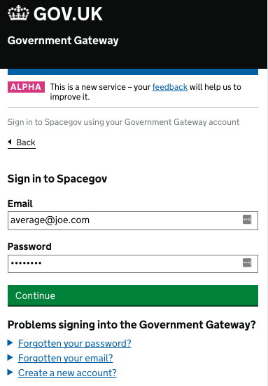

# Government Gateway 3 Functional Prototype

New Government Gateway authentication portal, offering a range of second factors,
 credential management, helpdesk and more... 
 
####[Live Prototype](https://gg3alpha.herokuapp.com)
 
 

### Overview 

* See the live prototype [here](https://gg3alpha.herokuapp.com)
* [Cucumber report](https://gg3alpha.herokuapp.com/docs/cucumber.html)
* [Screenshots](./docs/screenshots)
 

### Technology stack
* Javascipt ES6 (Babel)
* [React](https://facebook.github.io/react/)
* Webpack
* Node
* Express
* Heroku (PaaS)

### Screen Design
* [GOV.UK elements](http://govuk-elements.herokuapp.com/)
* [GOV.UK Frontend Toolkit](https://github.com/alphagov/govuk_frontend_toolkit)

### Testing
* [Capybara](https://github.com/jnicklas/capybara)
* Cucumber


# Developer stuff.....


#### Setting up your Mac

#####Install Node version manager and node 5.11.1

```
    curl -o- https://raw.githubusercontent.com/creationix/nvm/v0.31.0/install.sh | bash
    # close terminsal and reopen
    nvm install 5.11.1
```

#####Install ruby version manager
```
    curl -sSL https://get.rvm.io | bash -s stable
    rvm install 2.2.3
    rvm use --defult 2.2.3
```

#####Install phantomjs
```
    brew install phantom
```

#####Download the code
```
    git clone git@github.tools.tax.service.gov.uk:hmrc/gg3-alpha.git
    cd gg3-alpha
```


#####Start server

```
    npm install
    npm run dev
```
This will start an express server listening on https://localhost:3000

#####Testing

```
    bundle
    bundle exec cucumber browser=phantom
    bundle exec cucumber
```


#####Generating screenshots and report
```
    bundle exec cucumber browser=phantom --format html --format pretty --out docs/cucumber.html
```


#####Deploying to heroku

Download and install [heroku toolbelt](https://toolbelt.heroku.com/).  

```
    git push heroku master
```

You will need to add an env variable to heroku:
```
    NPM_CONFIG_PRODUCTION=false
```