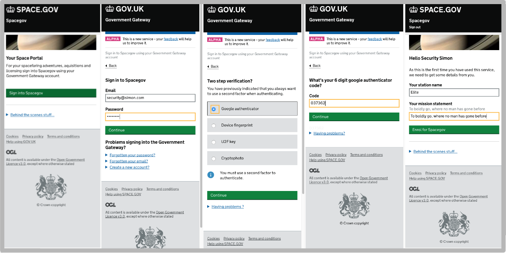

# Government Gateway 3 Functional Prototype

New Government Gateway authentication portal, offering a range of second factors,
 credential management, helpdesk and more... 
 
####[Live Functional Prototype](https://gg3alpha.herokuapp.com)
 
 

### Overview 

* See the live prototype [here](https://gg3alpha.herokuapp.com)
* [Cucumber features](./features)
 

### Technology stack
* Javascipt ES6 (Babel)
* [React](https://facebook.github.io/react/)
* Webpack
* Node
* Express
* Heroku (PaaS)

### Screen Design
* [GOV.UK elements](http://govuk-elements.herokuapp.com/)
* [GOV.UK Frontend Toolkit](https://github.com/alphagov/govuk_frontend_toolkit)

### Testing
* [Capybara](https://github.com/jnicklas/capybara)
* Cucumber


# Developer stuff.....


#### Setting up your Mac

#####Install Node version manager and node 5.11.1

```
    curl -o- https://raw.githubusercontent.com/creationix/nvm/v0.31.0/install.sh | bash
    # close terminsal and reopen
    nvm install 5.11.1
```

#####Install ruby version manager
```
    curl -sSL https://get.rvm.io | bash -s stable
    rvm install 2.2.3
    rvm use --defult 2.2.3
```

#####Install phantomjs
```
    brew install phantom
```

#####Download the code
```
    git clone git@github.tools.tax.service.gov.uk:hmrc/gg3-alpha.git
    cd gg3-alpha
```


#####Start server

```
    npm install
    npm run dev
```
This will start an express server listening on https://localhost:3000

#####Testing

```
    bundle
    bundle exec cucumber browser=phantom
    bundle exec cucumber
```


#####Generating screenshots
```
    bundle exec cucumber browser=phantom screenshots=true features/screenshots.feature 
```


#####Deploying to heroku

Download and install [heroku toolbelt](https://toolbelt.heroku.com/).  

```
    heroku create carrielies-second-factors --buildpack https://github.com/heroku/heroku-buildpack-nodejs.git
    git push heroku master
```

You will need to add an env variable to heroku:
```
    NPM_CONFIG_PRODUCTION=false
```

Also, enable the following plugins:
```
    heroku labs:enable runtime-dyno-metadata
```


#####Deploying to cloud foundary

Install cloud foundary client:
```
    brew install cf
```

Log into cloud foundary using our trial account:

```
    cf login -a api.cf.skyscapecloud.com
    mark.middleton@mdtpcollab.digital.hmrc.gov.uk / sWAtre3@
```

Create stage folder and push:
```
    rake cf:stage
    cd cf_stage
    cf push
    cf apps
    
    Getting apps in org 28-686-2 / space gg3alpha as mark.middleton@mdtpcollab.digital.hmrc.gov.uk...
    OK
    
    name   requested state   instances   memory   disk   urls
    gg3    started           1/1         512M     512M   gg3alpha.cf.skyscapecloud.com    
```

Navigate to:  [https://gg3alpha.cf.skyscapecloud.com](https://gg3alpha.cf.skyscapecloud.com)


I've also got a pivotal account setup which works in exactly the same way:
 
```
    cf login -a api.run.pivotal.io
    markymiddleton@gmail.com / Test12345
```


### Notes

* [Original click through prototype demo site](https://gg3prototype.herokuapp.com)
* [Original click through prototype github](https://github.tools.tax.service.gov.uk/HMRC/gg3-prototype)


